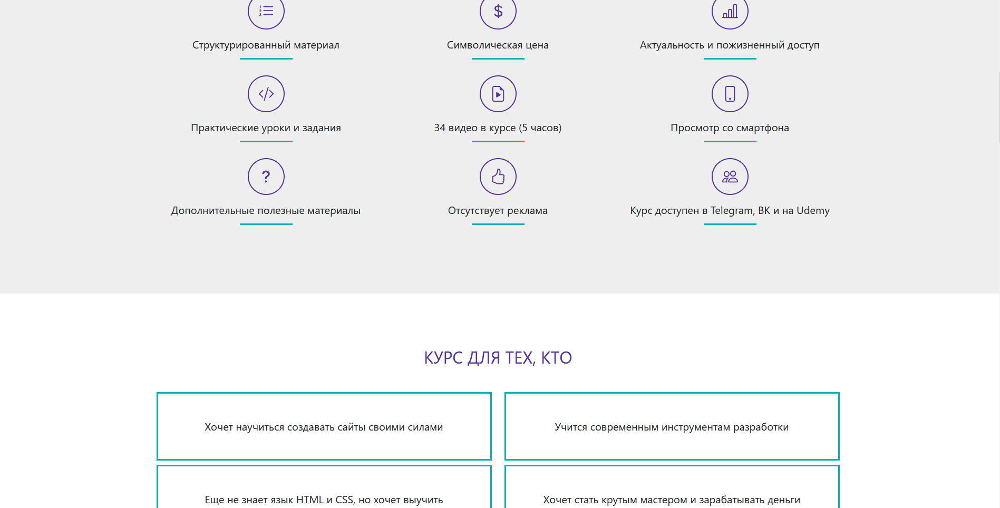

# Видеокурс по вёрстке на HTML/CSS


## О проекте

Этот проект — лендинг видеокурса по основам HTML и CSS. Сайт демонстрирует структуру курса, преимущества, отзывы, информацию об авторе и варианты приобретения. Используется современная адаптивная вёрстка с Bootstrap 5 и кастомными стилями.

## Структура проекта

- `index.html` — основная страница, содержит разметку всех секций (о курсе, программа, отзывы, покупка и др.)
- `styles.css` — пользовательские стили для оформления и адаптации элементов

## Как запустить

1. Скачайте или клонируйте репозиторий:
   ```sh
   git clone https://github.com/AndeBurm/html-css-course-landing.git
   ```
2. Откройте файл `index.html` в любом современном браузере.

## Для кого проект
- Новички, желающие изучить HTML и CSS с нуля
- Все, кто хочет быстро освоить основы вёрстки и получить практические навыки
- Преподаватели и авторы курсов для примера структуры лендинга образовательного продукта

## Используемые технологии
- HTML5, CSS3
- Bootstrap 5 (CDN)
- SVG-иконки

## Как доработать
- Изменяйте содержимое секций в `index.html` под свои задачи
- Добавляйте новые стили или адаптируйте существующие в `styles.css`
- Для расширения функционала используйте JS и подключайте новые библиотеки по необходимости

## Поддержка и обратная связь
- Вопросы по курсу — через контакты, указанные в футере сайта
- Для технических вопросов и предложений — создавайте issue на Github после публикации
